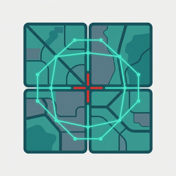
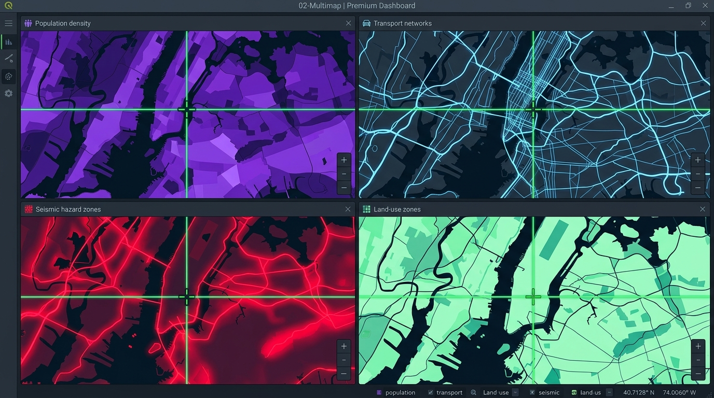

# 02-Multimap: Sync-up Multimaps

**Multi-panel synchronized map visualization workspace for QGIS 4. Open 2, 3, 4, 6, or 8 map views in a coordinated grid layout with real-time navigation syncing and laser pointer crosshair tracking.**

---

## Why 02-Multimap?

Urban planners, environmental scientists, and demographers often need to compare multiple spatial patterns side-by-side: historical urban growth, demographic variations (e.g., age groups, income levels), hazard risks (flood zones vs. landslide vulnerabilities), or temporal policy variations. 

Instead of toggling layers on and off in a single QGIS map canvas, **02-Multimap** provides a unified workspace container hosting up to 8 independent map views. Panning or zooming on one view immediately coordinates all others, while a coordinated laser crosshair tracks cursor positions dynamically across all panels.

## ✨ Features

- **Dynamic Layout Grids** — Instantly switch between multiple panel configurations: 2 panels (1x2 or 2x1), 3 panels (1x3), 4 panels (2x2), 6 panels (2x3), or 8 panels (2x4).
- **Bi-directional Navigation Sync** — Drag or scroll zoom in any panel to update the rest. Optionally link navigation back to the main QGIS map canvas.
- **Laser Crosshair Tracking** — Move your mouse on any panel to project neon-colored crosshairs tracking the exact same geographic coordinate across all other views and the main QGIS canvas.
- **Dynamic Render Modes** — Configure each panel to render different source layers:
  - *Sync Main Map*: Follows active layers in the main QGIS Legend Layer Tree.
  - *Focus Layer*: Isolates a specific layer on top of a globally-defined base map layer.
  - *Map Theme*: Follows a custom QGIS Map Theme (layer visibility and style preset).
- **Elite Dark QSS Interface** — Features a premium dark-themed styling with coordinate tracking readouts, active panel border highlights, and responsive controls.
- **QGIS 4 & PyQt6 Optimized** — Engineered from the ground up for QGIS 4 using PyQt6, with zero legacy dependencies and 100% English interface text.
- **100% E2E Verified** — Tested using a headless automated execution harness to verify GUI rendering, grid rebuilding, and coordinate calculations under real QGIS 4.

## 🚀 Installation

**From the QGIS Plugin Hub:** `Plugins → Manage and Install Plugins…` → search for **"02-Multimap"** → *Install*.

**From a release zip:** Download the latest zip from [Releases](https://github.com/YusufEminoglu/zero2multimap/releases) → `Plugins → Install from ZIP`.

Requires QGIS 4.0 or newer.

## 📖 Quick Start

1. Define a few **Map Themes** in your QGIS project (e.g., theme "1990", theme "2010", theme "2030").
2. Open the workspace from the toolbar or the **02-Multimap** menu.
3. Choose the **4 Panels (2x2)** grid size.
4. Set Panel 1 to Map Theme "1990", Panel 2 to Map Theme "2010", and Panel 3 to Map Theme "2030".
5. Pan and zoom around to compare urban expansion over time with real-time cursor coordinate tracking.

## ⚙️ Layout Grid Reference

| Grid Configuration | Layout Matrix | Ideal For |
|--------------------|---------------|-----------|
| **2 Panels (1x2)** | 1 Row x 2 Columns | Before/after comparison, suitability vs. actual, side-by-side |
| **2 Panels (2x1)** | 2 Rows x 1 Column | Vertical terrain profiles, screen-optimized comparisons |
| **3 Panels (1x3)** | 1 Row x 3 Columns | Past, present, and future scenario timelines |
| **4 Panels (2x2)** | 2 Rows x 2 Columns | Multi-scenario comparison, demographic cross-checks |
| **6 Panels (2x3)** | 2 Rows x 3 Columns | Multi-criteria evaluations, regional comparisons |
| **8 Panels (2x4)** | 2 Rows x 4 Columns | Heavy temporal/categorical zonation analyses |

## 🧩 Part of the PlanX / 02viz ecosystem

**02-Multimap** is part of the 16 open-source QGIS plugins for urban planning and visual analysis:

| Planning & analysis | CAD & production | Visualization & display |
|---|---|---|
| [PlanX](https://github.com/YusufEminoglu/PlanX) — spatial-planning suite | [PlanX CAD Toolset](https://github.com/YusufEminoglu/PlanX-CAD) — drafting-grade CAD | [PlanX 3D City](https://github.com/YusufEminoglu/planx_3d_city) — Three.js city viewer |
| [GeoStats Lab](https://github.com/YusufEminoglu/planx_geostats) — spatial statistics | [EasyFillet](https://github.com/YusufEminoglu/EasyFillet) — tangent-arc fillet | [3D OSM Model](https://github.com/YusufEminoglu/osm_3d_model) — OSM → 3D city in browser |
| [Suitability Lab](https://github.com/YusufEminoglu/planx_suitability_lab) — raster MCDA | [Settlement Toolset](https://github.com/YusufEminoglu/PlanX-Settlement) — 9-stage settlement plans | [OSM Quick 3D](https://github.com/YusufEminoglu/osm_quick_3d) — OSM → native QGIS 3D |
| [DataCube Lab](https://github.com/YusufEminoglu/planx_datacube) — spatiotemporal cubes | [UIP Toolset](https://github.com/YusufEminoglu/PlanX-UIP) — Turkish master-plan automation | [Urban Procedural 3D](https://github.com/YusufEminoglu/planx_urban_procedural_3d) — parametric zoning lab |
| [Urban Resilience](https://github.com/YusufEminoglu/planx_urban_resilience) — 28 resilience tools | [ParcelFlux](https://github.com/YusufEminoglu/parcelflux) — parcel subdivision | [CartoLab](https://github.com/YusufEminoglu/planx_cartolab) — publication cartography |
| [02viz](https://github.com/YusufEminoglu/02viz) — visualization studio | | [02-Multimap](https://github.com/YusufEminoglu/zero2multimap) — sync-up multimaps |

## 📜 License & author

GPL-3.0 © [Yusuf Eminoğlu](https://github.com/YusufEminoglu) — bug reports and feature requests welcome in [Issues](https://github.com/YusufEminoglu/zero2multimap/issues).
