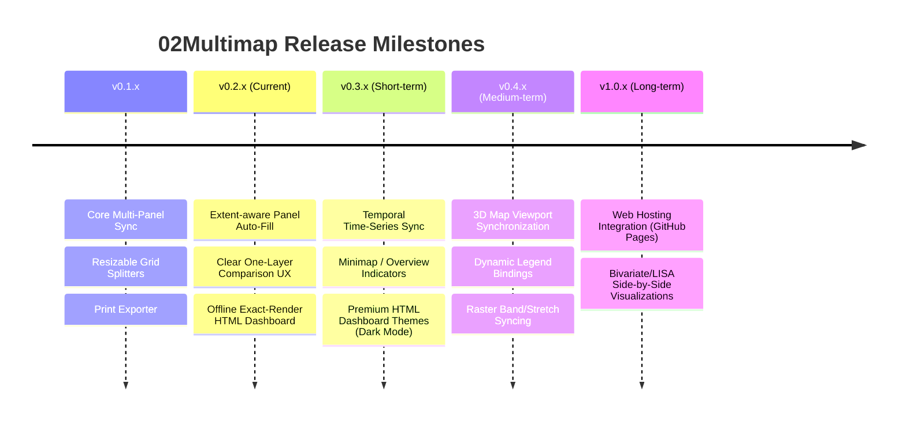

# Roadmap & Future Features — 02Multimap

This document outlines planned improvements, future feature additions, and technical milestones for **02Multimap: Sync-up Map Layers**, aligning it with the wider **PlanX / 02viz** urban analytics ecosystem.

---

## 📅 Roadmap Overview

---

## 🛠️ Planned Features & Specifications

### 1. Short-Term Enhancements (v0.2 - v0.3)

#### A. Temporal Time-Series Synchronization
- **Goal**: Synchronize temporal layer settings across map canvases for time-series analysis (e.g., comparing years 2000, 2010, 2020 side-by-side).
- **Implementation**: Connect with QGIS `QgsTemporalController` to dynamically set different temporal ranges/timestamps for each viewport card based on selected dates.

#### B. Minimap & Overview Extent Box Indicators
- **Goal**: Allow viewports operating at different zoom scales to project bounding boxes representing the extents of other panels.
- **Implementation**: Draw a dynamic bounding box rectangle overlay on the main viewport representing the bounding coordinates of zoomed-in focus viewports.

#### C. Premium Interactive HTML Dashboard Themes
- **Goal**: Provide alternative visual style layouts for the exported HTML pages.
- **Implementation**: Add dropdown layouts in the Print Exporter:
  - **Dark Slate theme**: A premium night-themed Leaflet style.
  - **Analytics Sidebar Layout**: An interactive sidebar layout containing a layer list toggler, project metadata description, and stats readouts.

---

### 2. Medium-Term Enhancements (v0.4 - v0.5)

#### A. 3D Viewport Coordination
- **Goal**: Co-align QGIS 3D Map Views with 2D comparative map viewports.
- **Implementation**: Automatically query active `Qgs3DMapCanvas` views and synchronize their center camera targets and pitch/yaw rotation angles to mirror changes made on the active 2D panels.

#### B. Viewport-Specific Legend Cards
- **Goal**: Include legend graphics matching the locked themes or active layers inside the header of each individual panel card.
- **Implementation**: Add expandable QFrame boxes displaying raster color scales or vector categories inside each map widget.

#### C. Raster Band & Stretch Syncing
- **Goal**: Dynamically link raster rendering parameters (contrast stretch, color bands, min/max clip) across viewports.
- **Implementation**: Add sync controls for raster data comparison (e.g., comparing different band combinations like False Color vs. Natural Color of Landsat/Sentinel imagery side-by-side).

---

### 3. Long-Term Enhancements (v1.0 & Beyond)

#### A. Automated Web Hosting Deployment
- **Goal**: Allow users to deploy their interactive map dashboards straight to the web in one click.
- **Implementation**: Integrate GitHub Pages API or secure FTP/Cloud Storage pipelines. Users enter their repo details, and the plugin compiles, uploads, and generates a public URL (e.g., `https://username.github.io/my-comparison-map/`).

#### B. Real-Time Spatial Analytics Side-by-Side
- **Goal**: Embed lightweight geospatial analysis engines (e.g., calculating spatial buffers, hotspots, or LISA clusters) directly on the active coordinates inside each panel, updating instantly as the user pans.

---

## 💡 Contribution Guidelines

When implementing features from this roadmap:
1. Ensure full backwards compatibility with **QGIS 3.40 LTR** and future **QGIS 4.x** versions.
2. Maintain the slate-teal `#2a8f85` visual theme system.
3. Ensure any new GUI elements are fully covered in the E2E verification test script (`scratch/zero2multimap_import_check.py`).
